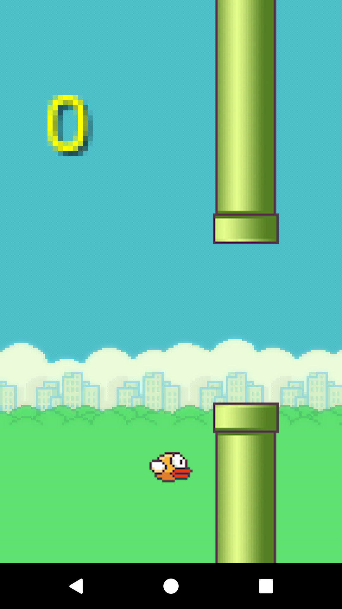
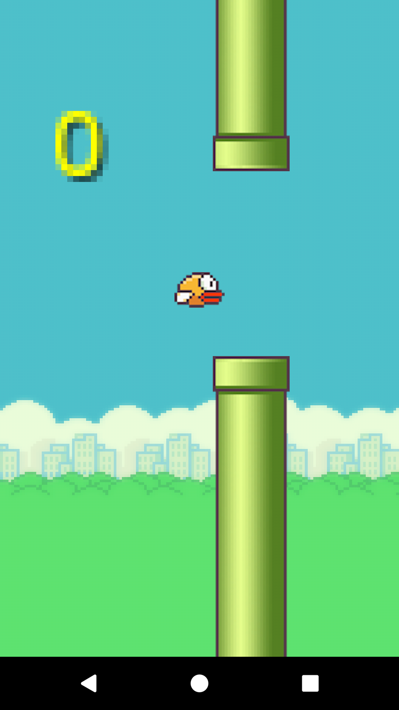
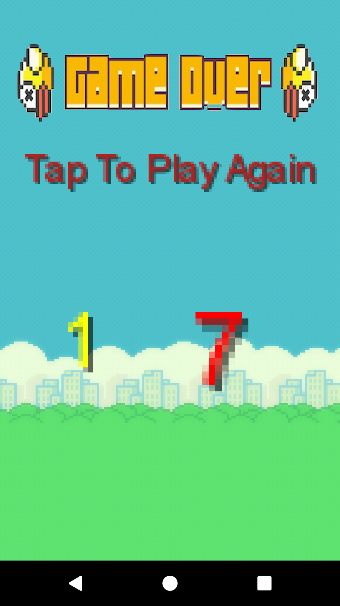

# Flappy-Birds
Using libGDX to create a 2-D Game in android.
Flappy bird was a 2-D mobile game developed by<a href='https://www.crazygames.com/'> Crazy games</a>
I just tried to mimic the game and learn libGDX through this.

Below are some screens of the game.
 

 

 

 

